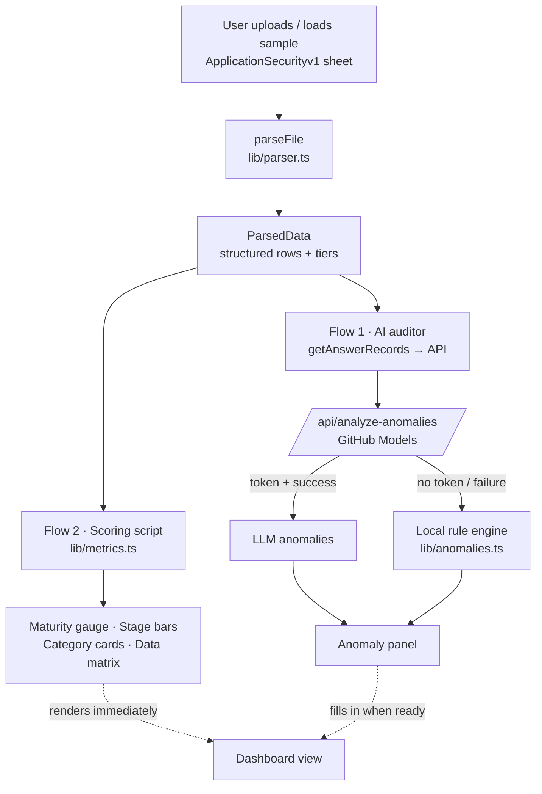

# SecPulse — Application Overview

> A plain-language guide to **what SecPulse is**, **how it thinks**, and **how
> the pieces fit together**. Read this before diving into the code; the
> [README](README.md) covers setup and commands, this document covers concepts.

---

## 1. What problem does it solve?

Security teams send an **Application Security maturity questionnaire** to every
project team. Each team rates themselves on ~18 controls using a four-tier scale
and writes a justification comment for each rating.

Two problems show up when those sheets come back:

1. **Scoring is tedious and inconsistent.** Someone has to total the points,
   work out percentages, and eyeball where each project is strong or weak.
2. **Self-assessments drift from reality.** A team may mark a control as fully
   mature while their own comment admits the work is "planned for next quarter",
   or claim an advanced capability while a foundational prerequisite is "Not
   Started".

**SecPulse** ingests one of these sheets and does both jobs automatically:

- A **scoring script** turns the sheet into a maturity dashboard (gauge, stage
  distribution, per-category breakdown, searchable matrix).
- An **LLM auditor** (via GitHub Models) reads the same sheet and flags the two
  kinds of self-assessment contradictions above.

---

## 2. The mental model: one sheet, two flows

The single most important idea in SecPulse is that an uploaded sheet feeds **two
independent flows** that share exactly one parse pass.



**Why two flows?** The dashboard must never wait on the model. Parsing + scoring
is instant and deterministic, so it renders right away. The LLM call is slower
and may fail, so it runs in parallel with its own loading state and a guaranteed
local fallback.

---

## 3. The four-tier maturity model

Every control is scored on one of four tiers, plus an optional "Not Applicable".

| Tier label                       | Points | Meaning (short)                              |
| -------------------------------- | :----: | -------------------------------------------- |
| `Not Started [0]`                |   0    | Nothing in place.                            |
| `Partially Implemented [1]`      |   1    | Exists in parts; inconsistent.               |
| `Consistently Implemented [2]`   |   2    | Standardised and applied across teams.       |
| `Embedded & Measured [3]`        |   3    | Enforced, automated, and measured.           |
| `Not Applicable`                 |   —    | Out of scope; **excluded from scoring**.     |

This lives in [lib/scores.ts](lib/scores.ts). The `parseScore()` function is
deliberately tolerant — it reads a cell by checking, in order:

1. "Not Applicable" / "N/A" → `na`
2. A bracketed weight like `[3]` → that tier
3. A keyword like "embedded" or "partial" → that tier
4. A bare number `0`–`3` → that tier
5. Anything else / blank → `null` (unanswered)

---

## 4. How the score is calculated

The maturity percentage is a simple weighted ratio computed in
[lib/metrics.ts](lib/metrics.ts):

$$
\text{percent} = \frac{\text{points earned}}{3 \times \text{scored items}} \times 100
$$

Key rules:

- **N/A and unanswered items are removed from the denominator** — a project is
  not penalised for controls that do not apply to it.
- Each scored item can contribute at most `MAX_POINTS = 3`.
- The same formula is reused per category for the breakdown cards.

### Worked example

| Item | Tier | Points |
| ---- | ---- | :----: |
| A | `Embedded & Measured [3]` | 3 |
| B | `Partially Implemented [1]` | 1 |
| C | `Not Started [0]` | 0 |
| D | `Not Applicable` | excluded |
| E | _(blank)_ | excluded |

Earned = 3 + 1 + 0 = **4**. Scored items = 3 → Possible = 3 × 3 = **9**.
Percent = 4 ÷ 9 ≈ **44%**. (Items D and E never enter the maths.)

> This mirrors the bundled template, which scores **32 / 48 → 67%** across 16
> scored items (2 are N/A).

---

## 5. How anomaly detection works

The auditor looks for exactly **two archetypes**. Both are implemented twice:
once as an LLM prompt ([app/api/analyze-anomalies/route.ts](app/api/analyze-anomalies/route.ts))
and once as a deterministic regex engine ([lib/anomalies.ts](lib/anomalies.ts))
used as a fallback, so output is guaranteed even with no API token.

### Archetype 1 — Comment Contradiction

A **high score** (`Consistently Implemented [2]` or `Embedded & Measured [3]`)
whose **comment admits the work isn't done** — phrases like "planned", "next
quarter", "evaluating", "in progress", "POC", "TBD".

> _Example:_ "Semgrep SAST scans" marked `Embedded & Measured [3]`, comment says
> "we are still evaluating the tool right now". → **High severity contradiction.**

### Archetype 2 — Dependency Disconnect

An **advanced control** marked `Embedded & Measured [3]` while a **foundational
prerequisite** is `Not Started [0]`. It is improbable to embed advanced metrics
without the foundations.

> _Example:_ "Security architecture patterns defined" = `Not Started [0]`, but
> "IaC deployment gates" = `Embedded & Measured [3]`. → **High severity.**

### Request / response contract

```jsonc
// POST /api/analyze-anomalies  — request
{ "target": "Project Assessment", "answers": [ { "category", "question", "selected_score", "tier", "comment" } ] }

// response
{ "anomalies": [ { "type", "item", "severity", "explanation" } ],
  "source": "github-llm" | "fallback", "model"?, "notice"? }
```

The route validates the body, calls GitHub Models with a 25 s timeout, strips
code fences, parses the JSON array, and normalises every entry. **Any** failure
(missing token, timeout, bad JSON) degrades cleanly to the local engine and sets
a `notice`.

---

## 6. Expected file format

The parser targets the **`ApplicationSecurityv1`** worksheet. In a multi-sheet
workbook the other sheets (`Summary Dashboard`, the unversioned
`ApplicationSecurity`) are **ignored** — only sheet 1 drives the app.

| # | Column (header keyword)        | Used for                              |
| - | ------------------------------ | ------------------------------------- |
| 1 | Appsec **Category**            | Grouping (forward-filled)             |
| 2 | Appsec **Maturity Stage**      | Stage label (forward-filled)          |
| 3 | **Assessment Item**            | The question text                     |
| 4 | Project **Assessed Score**     | The tier → points                     |
| 5 | **Comments**                   | Justification (drives anomalies)      |
| 6 | **Description**                | "What this question means" (drawer)   |
| 7 | Examples / **Evidence**        | Reference evidence (drawer)           |
| … | _per-tier "Scoring Criteria"_  | **Ignored** reference columns         |

Columns are matched by **header keyword, not position**, so banner rows, extra
reference columns, or re-ordered columns are handled automatically. Merged
Category/Stage cells are forward-filled down their continuation rows.

---

## 7. Code map

```
app/
  api/analyze-anomalies/route.ts   # Flow 1: GitHub Models call + local fallback
  layout.tsx                       # Root layout, fonts, theme
  page.tsx                         # Orchestrates both flows + all state
components/
  ui/                              # Card, Badge, Button, Select primitives
  FileUpload      → drag-and-drop ingest
  TeamSelector    → assessment-target dropdown
  MaturityScore   → circular gauge (earned ÷ possible)
  StageDistribution → per-tier bar chart
  CategoryBreakdown → per-category cards
  AnomalyReport   → grouped anomaly cards + source badge
  DataTable       → searchable matrix + per-item detail drawer
  Navbar
lib/
  scores.ts        # 4-tier model: parseScore, points, labels
  parser.ts        # xlsx / CSV → ParsedData (ApplicationSecurityv1 only)
  metrics.ts       # getMaturity / getCategoryBreakdown / getAnswerRecords
  anomalies.ts     # local rule engine + LLM-output normaliser
  constants.ts     # category icons / tier styles
  types.ts         # shared domain types
  utils.ts         # cn() class-name helper
public/
  Security Governance - Effectiveness Questionnaire_v2.0.xlsx   # bundled template
```

### Who owns what

| Concern                | Module                          |
| ---------------------- | ------------------------------- |
| Tier definitions/maths | `lib/scores.ts`                 |
| Reading the sheet      | `lib/parser.ts`                 |
| Turning rows → numbers | `lib/metrics.ts`                |
| Detecting anomalies    | `lib/anomalies.ts` + API route  |
| Wiring + state         | `app/page.tsx`                  |
| Presentation           | `components/*`                  |

---

## 8. End-to-end walkthrough

1. **Upload.** `FileUpload` hands a `File` to `ingest()` in `app/page.tsx`.
2. **Parse (once).** `parseFile()` selects `ApplicationSecurityv1`, resolves
   columns by keyword, forward-fills merged cells, and returns `ParsedData`.
3. **Flow 2 fires immediately.** `getMaturity()` / `getCategoryBreakdown()` feed
   the gauge, stage bars, category cards and matrix — the dashboard appears.
4. **Flow 1 fires in parallel.** `getAnswerRecords()` flattens the rows and
   `POST`s them to `/api/analyze-anomalies`; the anomaly panel shows a spinner.
5. **Anomalies arrive.** The route returns LLM results (or local fallback) and
   the panel renders cards grouped by archetype with a source badge.
6. **Switching target** re-runs both flows for the newly selected assessment.

---

## 9. Design principles

- **Deterministic core, optional AI.** Scoring is pure and reproducible; the LLM
  only adds judgement on top and can always be replaced by the local engine.
- **Never block on the model.** The dashboard is useful even if the API is down.
- **Tolerant parsing.** Keyword column matching + flexible `parseScore` survive
  real-world spreadsheet messiness (banners, extra columns, merged cells).
- **Fair scoring.** N/A and blank items never count against a project.
- **Single source of truth for tiers.** Labels, weights, and styles all derive
  from `lib/scores.ts`, so the model is changed in one place.

---

## 10. Tech stack

| Layer      | Choice                                              |
| ---------- | --------------------------------------------------- |
| Framework  | Next.js 16 (App Router, Turbopack)                  |
| Language   | TypeScript 5                                        |
| UI runtime | React 19                                            |
| Styling    | Tailwind CSS 3 + custom CSS variables               |
| Icons      | lucide-react                                        |
| Parsing    | SheetJS `xlsx` (CDN build) + PapaParse for CSV      |
| AI         | GitHub Models (`openai/gpt-4o` by default)          |

See [README](README.md) for install, environment variables, and run commands.
